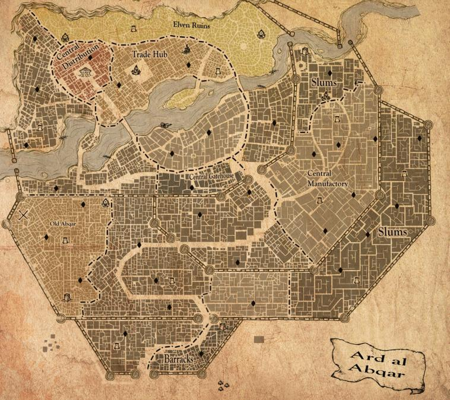
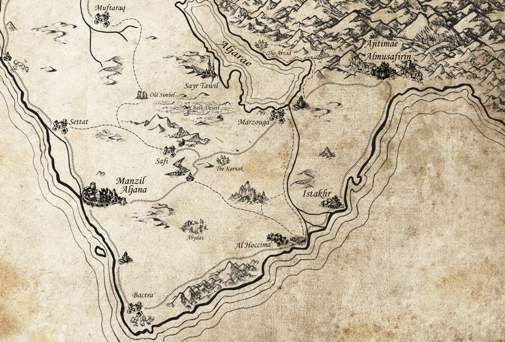
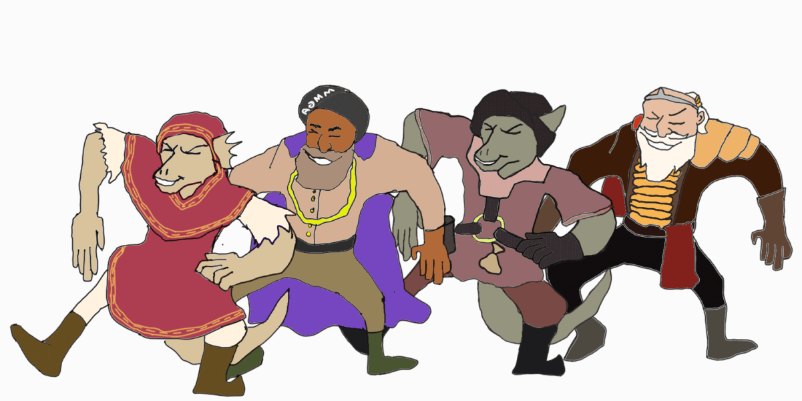

### Setting

This is set in a desert-ish area akin to the middle-east, ranging from dry tundra to the north and high desert to the south, with a more fertile area in the middle akin to mesopotamia.

[{: style="max-width: 500px; margin: 0 auto; display: block;" }](assets/world-map.png)

[{: style="max-width: 500px; margin: 0 auto; display: block" }](assets/Ard_al_Abqar_Map.jpg)

[{: style="max-width: 500px; margin: 0 auto; display: block" }](assets/map-of-the-south.png)

### Characters

There are [4 player-characters](characters). They have [some stuff](cart)

### Races

* Dwarves - conservative
* Kobolds - hypercapitalist
* Elves - neoliberals
* Humans - either way
* Minotaurs - communists

### Religions

Primarily Zoroastrianism-esque monotheism, with some desert tribes worshipping local deities. Magic exists, but most aren't aware of it or treat magical things as just "weird things happen sometimes".

Most of society is monotheist, worshipping  the four prophets which all emphasised different aspects of God.

Amon - Purity - Represented by light, the sun, and the stars

Cyhtega - Wisdom - Represented by knowledge, scholarly symbols, and long rolls of text

Hastar - Anger - Represented by war, weaponry, and fire

Eliphas - Love - Represented by life, nature, and the moon

### Sessions


#### [{{post.title}}]({{post.url}})

{{post.excerpt}}

[Read more...]({{post.url}})


### Chat logs

https://app.roll20.net/campaigns/chatarchive/3648642/?p=74
