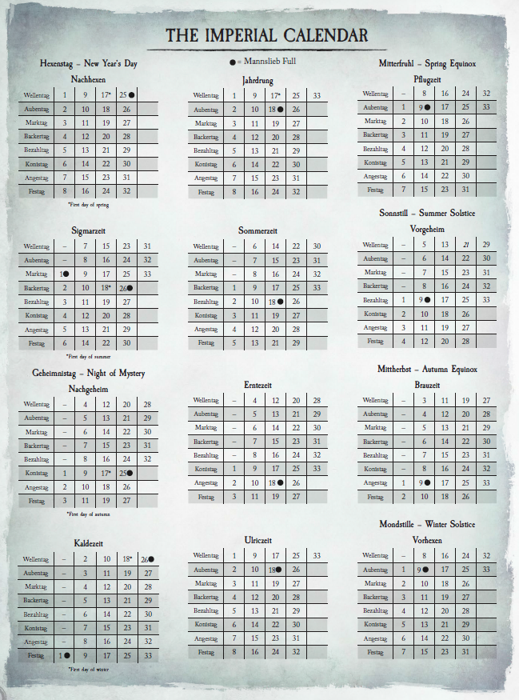

# Characters

* Bumblebee Bandersnatch --- halfling merchant/boatman
* Finonel Darkmeadow --- elf horselord/grifter
* "Heinrich Schmidt" --- ~human~ dwarf
* Morgan "Hoteye" Muffel --- halfling ratcatcher

# Calendar

# Log

## Day 4

We get out of dodge on Josef's urging since the noble's murder has the guards on edge. As we head down the river, some guards ride down next to us and warn us about a murder in the city, Bumblebee talks their ears off. Hoteye's cloak turns red??? There's a bounty hunter after "Heinrich" (that is, Thori) because he looks like [someone who has inherited gold and land](note.png) that he was going to impersonate. Some fuckers attacked the boat, probably for the bounty on Thori, but we fucked them up. Josef isn't super happy about it, and Finonel and Thori are snipping at each other.

## Day 3

We had some adventures in Altdorf, shopping for stuff. There were a few folks following us and eventually approached, but they were shot in front of us. Darkmeadow ran for the hills while we ran for Josef's boat, where we will stay and then travel to the [Schaffenfest](schaffenfest.png). There were some nobles who hired someone to get people into fights for their entertainment, which they try on us. It fails when Bumblebee recognizes what's happening, but (via Day 4) one of them gets murdered later that night.

## Day 2

We fought some corrupted baddies on the road, made it to Altdorf.

## Day 1

We wound up at an inn following a [job posting](job-posting.png), where Bumblebee essentially bribed everyone with liquor. Darkmeadow fought some fancy lady's bodyguard and won a sword, which he ~gave~ sold to Bumblebee, who was in awe of his ruthlessness.
