### Characters

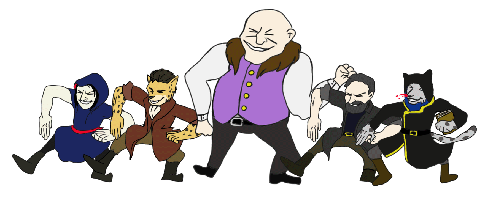

* Aliz Skultety --- Human --- Druid Hermit  
  "Trust in Nature!
* Minister Loomis Kanevsky --- Human --- Wizard  
  "Trust in Bureaucracy!"
* ~~Dro'Khan~~ [Stepan Vasilyiev](stepan.pdf) --- Cat folk --- Rogue  
  "Trust in your wits!"
* Kikarin ---- Corvid --- Forge cleric
* [Belek Oorzhak](belek) --- Cat folk --- Warlock  
  "Trust in--" *peeks at DM's notes, takes 1d6 damage*

#### NPCs

* The Sovereign (Theodore) via a Pyotr
* The Sovereign's son, Vasily
* Prospector
    * Thron Gorachi
* Fishers
    * Iki "Fishmasher" Volavogon, fisher goblin
    * Noyaven Yavinov, fisher human
    * Uri, one-armed fisher human
* Hunters
    * Pavel Viakov, hunter human
    * Kak Voi, hunter corvid
* Guards
    * Avari Vonusa
    * Aleks Therag
    * Ivan Draztini
    * Vanessa Ovagon
    * Phiri Anklebiter Berakov - halfling

### RIP In Pieces

* Norzen --- Human --- Monk
* Brother Grimbald Frey --- Werewolf --- Fighter  
  "Trust in Faith!"

### Map

[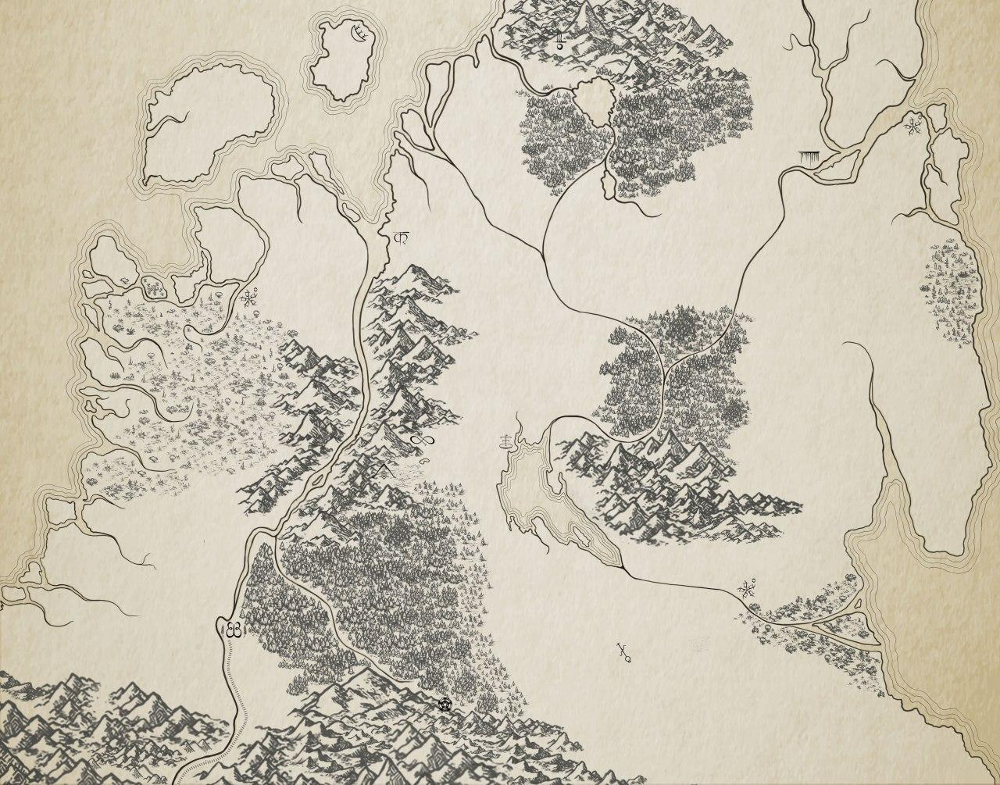](map.jpg)

### Calendar

[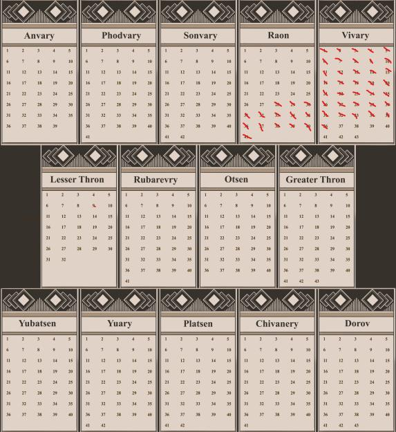](calendar.jpg)

### Unismus (the town)

<iframe src="https://docs.google.com/spreadsheets/d/e/2PACX-1vRu8zqSDyM6qT0QrkKAswTpD0BxXuEtxZifYBZhRDrMvWEYI_sjAK1TySbaRcRCkMrlwQL8wI1qxuYa/pubhtml?gid=0&amp;single=true&amp;widget=true&amp;headers=false" style="width: 100%; height: 700px;"></iframe>

### Files

* [Player's Handbook](players-handbook.pdf)
* [Buildings and settlement management](buildings.pdf)
* [Countries](countries.pdf)

### Rolls

<h4>KO roll (<code>/roll 1d40</code>)</h4>
<input type="number" placeholder="Input: /roll 1d40" onchange="koRoll(this.value) "/> <em>or</em> <button onclick="koRoll(-1)">Roll</button> 

<h4>Bestial Curse (<code>/roll 1d100</code>)</h4>
<input type="number" placeholder="Input: /roll 1d100" onkeyup="bcRoll(this.value)" /> <em>or</em> <button onclick="bcRoll(-1)">Roll</button> 
<em class="title">Result...</em> 

### Recordings

[The Great Expedition on archive.org](https://archive.org/details/the-great-expedition)

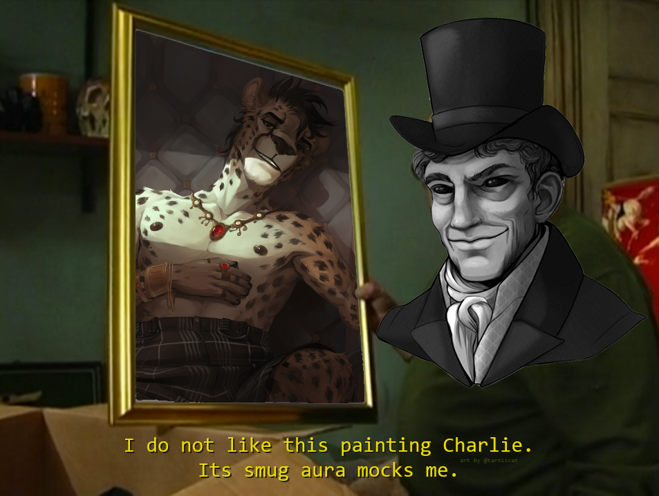

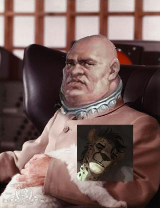

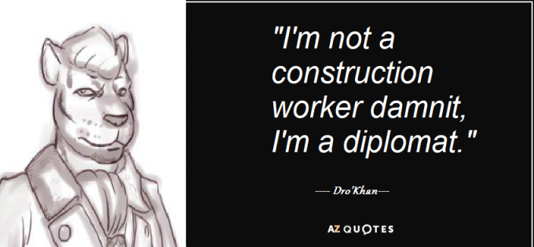

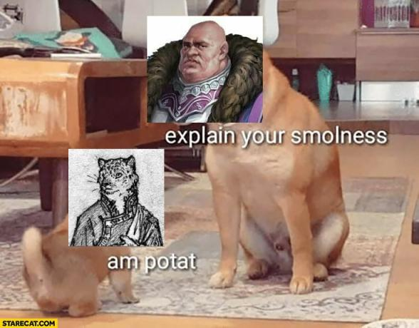

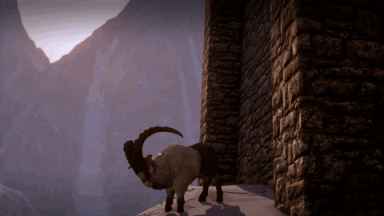

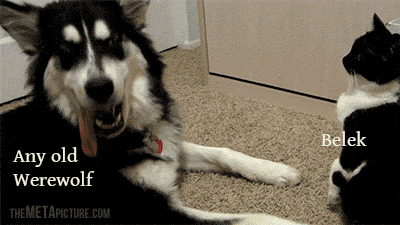

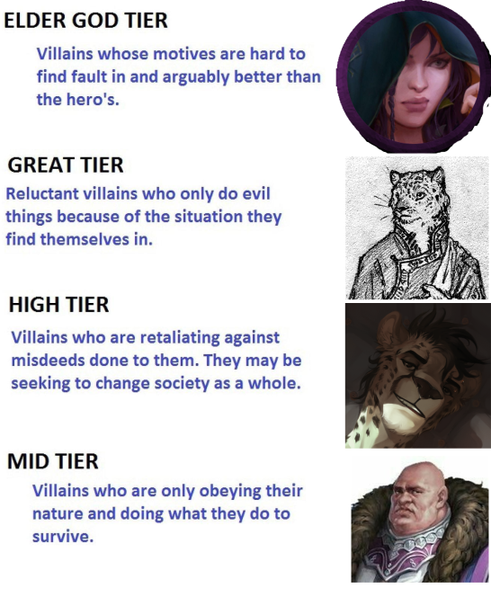

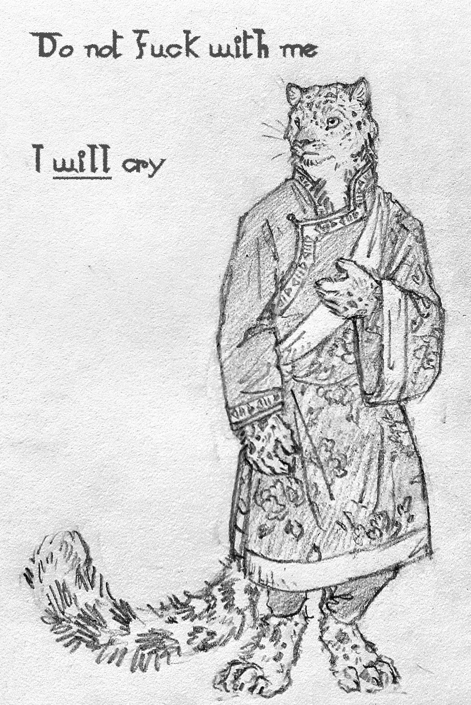
